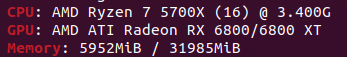

# The One Billion Row Challenge - SPŠ Kladno

Nápad převzatý z [The One Billion Row Challenge](https://github.com/gunnarmorling/1brc).

## Zadání

One Billion Row Challenge (1BRC) je zajímavý projekt, který posouvá hranice možností jazyka Python při zpracování obrovských souborů dat. Představte si, jak zajímavé je zpracovat miliardu řádků z textového souboru pomocí jazyka Python - kde lze využít všechny optimalizační triky, strategie pro správu vláken a paměti k vytvoření co nejrychlejšího řešení. Zúčastněte se této výzvy a využijte sílu Pythonu, prozkoumejte možnosti jazyka a odemkněte plný potenciál Pythonu pro zdolání tohoto monumentálního úkolu!

Textový soubor obsahuje hodnoty teploty pro řadu meteorologických stanic. Každý řádek je jedno měření ve formátu `<string: název stanice>;<float: měření>`, přičemž hodnota měření má přesně jedno desetinné místo. Jako příklad je uvedeno deset řádků:

```Hamburg;12.0
Bulawayo;8.9
Palembang;38.8
St. John's;15.2
Cracow;12.6
Bridgetown;26.9
Istanbul;6.2
Roseau;34.4
Conakry;31.2
Istanbul;23.0
```

Úkolem je napsat Python program, který přečte soubor a vypočte minimální, maximální a průměrnou teplotu pro každou stanici. Výsledky vypište na stdout ve formátu:
`{Abha=-23.0/18.0/59.2, Abidjan=-16.2/26.0/67.3, Abéché=-10.0/29.4/69.0, Accra=-10.1/26.4/66.4, Addis Ababa=-23.7/16.0/67.0, Adelaide=-27.8/17.3/58.5, ...}`
(seřazeno abecedně podle názvu stanice a výsledné hodnoty ve formátu `<min>/<avg>/<max>` zaokrouhleny na jedno desetinné místo).

## Získání dat

Prvním krokem k získání dat je stažení tohoto repozitáře. Tento repozitář obsahuje skript `create_measurements.py`, který vygeneruje soubor s zadaným počtem řádků. Soubor je ve formátu CSV, kde první sloupec obsahuje název stanice a druhý sloupec obsahuje hodnotu teploty.

Spusťte skript a vygenerujte data (pouze jednou):

```bash
python create_measurements.py 1000000000
```

**Pozor:** Genrování požadovaného množství dat může trvat několik minut. Výsledný soubor bude mít název `measurements.txt`, bude uložen ve složce `data` a bude mít velikost zhruba **12GB**.

## Pravidla a omezení

- Úloha musí být řešena v jazyce Python.
  - Můžete použít libovolnou verzi Pythonu.
  - Nepoužívejte žádné externí knihovny.
- Veškeré výpočty musí být provedeny v paměti a během chodu programu.
  - Není povoleno použít žádné databázové systémy ani jiné nástroje pro práci s daty.
- Implementace musí být odevzdána jako jeden soubror na tuto [stránku](http://1brc.hostgo.cloud/).
  - Program se spustí a po skončení Vám odešle na mail(povolena je pouze doména spskladno.cz) dobu chodu a zda výstup odpovídá očekávanému výsledku (kontroluje se pouze hash výstupu).
  - Počet řádků v souboru `./data/measurements.txt` na kterém se bude testovat funkčnost je 1 000 000 (ujistěte se, že váš program dokáže z této cesty načíst soubor).
  - Server má k dispozici 4GB RAM a 2 core CPU Intel Xeon Gold 5412U.
- Po ukončení soutěže spustím všechny programy na osobním PC a vyberu ten nejrychlejší.

## Vyhodnocení výsledků

Výsledky budou posouzeny po spuštění programu na osobním PC na verzi Pythonu [3.10.12](https://www.python.org/downloads/release/python-31012/).


Součástí procesu hodnocení bude i kontrola výstupu programu a případné nalezení nejkratší cesty ke správnému řešení.

Po vyhodnocení se všem účastnékům odešle na mail doba běhu a pořadí.

V případě, že se výstup bude lišit od očekávaného, bude program označen jako neúspěšný a nebude zařazen do žebříčku. Na email se Vám odešle seznam nalezených chyb.

V případě, že doba běhu programu přesáhne 10 minut bude program označen jako neúspěšný a nebude zařazen do žebříčku. Na email se Vám odešle informace o překročení limitu.

## Ceny

Pokud se zúčastníte této výzvy, můžete se naučit něco nového, inspirovat ostatní a být hrdí na svůj výkon. **Nějaké hmotné ceny???**

## Jak funguje odevzdávání programu na pozadí?

Pokud Vás zajímá jak funguje logika odevzdávání programu na pozadí, tak se můžete podívat na [tento repozitář](https://github.com/drillby/1brc_upload). Tento repozitář obsahuje source code pro Flask server, který zpracovává odevzdané programy a zasílá výsledky na email. Kód nemá dokumentaci, tak se v něm budete muset trochu pohrabat.
